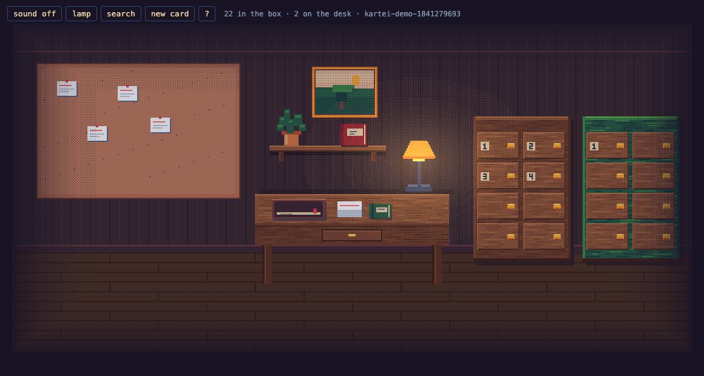
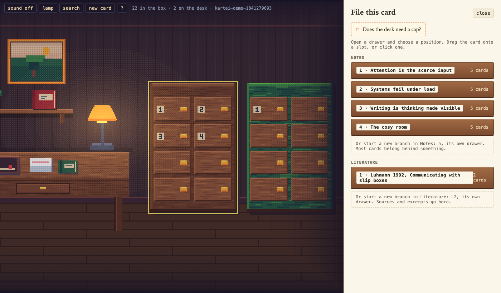
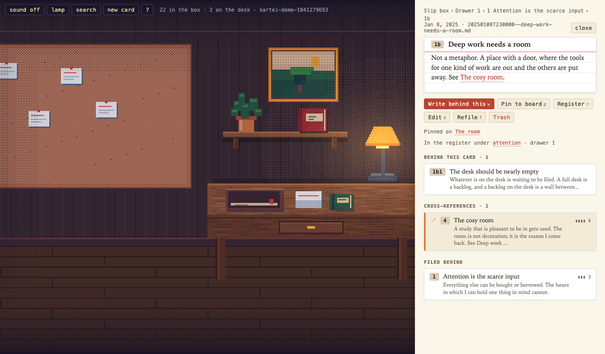
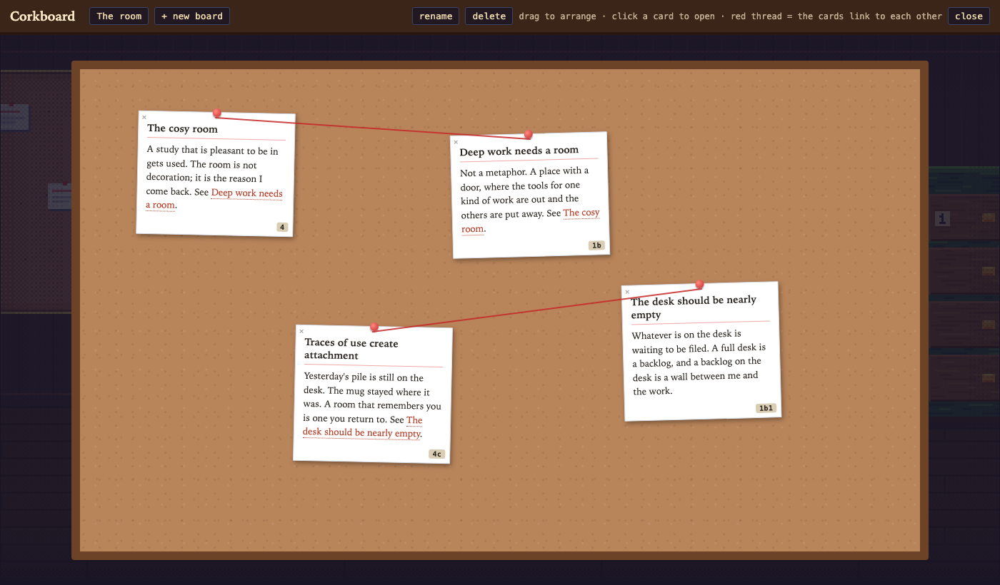
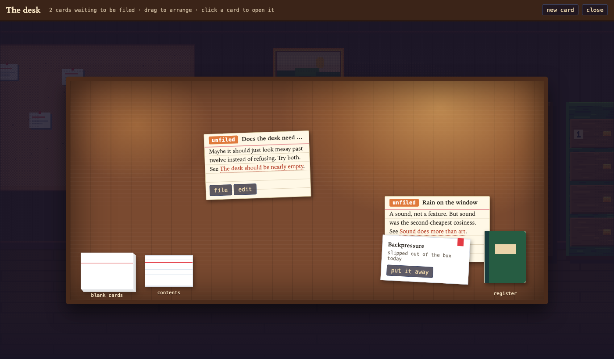

# Kartei

A zettelkasten you keep in a cosy study. *Kartei* is German for a card index,
the cabinet of slips Luhmann worked from. Notes are index cards: written at a
desk, filed behind the card they grew from, pulled out of numbered drawers,
pinned to a corkboard. Everything is plain markdown in a folder you choose,
editable in any other tool, and the room updates as you save.



`SPEC.md` is the current design. `docs/UI-GUIDE.md` is the contract for
anyone building another front end on the engine.

## Download

Prebuilt apps for macOS, Windows and Linux are on the
[releases page](https://github.com/haywardrl/kartei/releases). Unzip and run.

- **macOS:** the app is not notarised (that costs a yearly fee this free
  project does not pay), so the first time, right-click `Kartei.app`, choose
  Open, and confirm. After that it opens normally.
- **Linux:** needs GTK 3 and WebKitGTK 4.0, which most desktops already have
  (`libgtk-3-0` and `libwebkit2gtk-4.0-37` on Debian and Ubuntu).
- **Windows:** unzip and run `Kartei.exe`. SmartScreen may ask once.

Or build it yourself, below.

## Run it

You need Go 1.26 or newer. Nothing else for the browser version.

**In a browser:**

```
go run ./cmd/kartei --demo --serve     # a seeded 24-card vault in a temp folder, opens the room
go run ./cmd/kartei                    # your own vault at ~/Kartei (created if absent)
go run ./cmd/kartei --vault ~/notes    # any folder; the app names the files it creates
```

The room talks to the engine on a localhost port with a token minted for that
launch, so no other page can reach your notes. `Ctrl-C` saves and closes.

**The native app** (macOS) needs the Wails CLI once:

```
go install github.com/wailsapp/wails/v2/cmd/wails@latest
cd app && wails build                   # → app/build/bin/Kartei.app
open build/bin/Kartei.app
```

First launch asks for a folder for your slip box; pick an empty one. File ›
Open vault changes it later. `KARTEI_VAULT=/path` skips the dialog. If
`wails` is not on your path, run it as `"$(go env GOBIN)/wails"`. The build
log prints "Not found: time.Time" four times; that is Wails not knowing how to
type two date fields for TypeScript, and the room never reads those bindings.

The room is embedded in the binary, so after changing anything in `ui/` run
the build again, or use `wails dev` in `app/` for a window that reloads as you
edit.

## Using it

**Write.** Press `n`, or click the stack of blank cards on the desk. Give the
card a title and one idea. `⌘S` saves it. It lands in the inbox tray on the
desk with no address.

**File.** Open the card and press `f`. Pick a drawer, then either drop the card
*behind* another (a branch off it) or into the slot *after* one (next in its
line). The address appears, the drawer gains a card, the desk clears. "Start a
new branch" in either box is offered last, because most cards belong behind
something.



**Read.** Click a drawer on the slip box and it slides open; its cards appear
in the panel in address order. Click a card to pull it: the text, what is
filed behind it, its cross-references, and the card it grew from. `w` writes
the next thought behind it, filed at once.



**Find.** `/` searches titles then bodies. The contents ledger on the wall
shelf lists every drawer by number and title. The register, the green ledger
on the desk, is your own index: press `r` on any card to enter it under a term
in your words.

**Work.** `b` opens the corkboard. Pin cards from the box with `p`; they stay
in their drawers. Red thread joins pinned cards that link to each other.



**The desk.** Click the desk for the top-down view: every unfiled card laid
out in full, drag to arrange. Once a day one old card slips out of the box and
lies here with a red tab. "Put it away" hides it until tomorrow.



**In the room:**

| Object | What it does |
|---|---|
| Slip box | Eight numbered drawers to a box. Past eight the archive is more boxes: click the box to turn to the next; pips on the lid say which one is showing. Click a drawer to open it. |
| Literature box | The green box beside it, for sources (`L1`) and their excerpts (`L1a`). Works the same way. |
| Inbox tray | The unfiled cards as one stack. Red tab: a card slipped out today. Orange pip: past twelve. Click for the desk view. |
| Blank cards | A new card. |
| Register | The green ledger on the desk. Your index of terms. |
| Contents ledger | On the wall shelf. Which number is which drawer, in both boxes. |
| Corkboard | Working sets, full screen. |
| Lamp | Toggles. The room darkens with your clock and the lamp pools light. |

**Keys:** `/` search · `n` new card · `s` slip box · `b` corkboard · `i` the
desk · `r` register · `f` file or refile the open card · `w` write behind it ·
`p` pin · `e` edit · `l` lamp · `?` help · `Esc` close. Type `[[` in the editor
to link to another card. Every panel has a back button that retraces your
trail.

**With other editors.** Open any note in the vault folder in another editor
and save; the card in the room updates. If you edit the same card in both
places, the room notices and asks which version to keep. It never overwrites
silently.

## How the system works

If you have never kept a slip box, this is the idea in six points.

1. **The life of a card.** You write a card. It lies on the desk with no
   address. You file it: you decide which card it belongs behind, or which it
   follows. That decision gives it an address, a drawer, and clears the desk.
   The desk is the inbox. The box is everything you have decided about.
2. **Behind and after.** Filing *behind* a card starts a branch off it. Filing
   *after* a card continues its line.

   ```
   1     Attention is the scarce input
   1a    Notifications are interruptions          (filed behind 1)
   1b    Deep work needs a room                    (filed after 1a)
   1b1   The desk should be nearly empty           (filed behind 1b)
   2     Systems fail under load                   (a new branch)
   ```

   Addresses are derived from those decisions and never stored. Refile a card
   and its branch moves with it; the addresses recompute.
3. **Filing is not linking.** The tree says where a card *grew from*. A
   `[[link]]` in the text says what it *mentions*, anywhere in either box.
   Links are written by ID, so they survive renames and refiling.
4. **Drawers.** Filled in address order a whole branch at a time, numbered on
   the front. Small branches share a drawer; a branch that outgrows its drawer
   spills into the next. A drawer is a stretch of the sequence, not a topic. The contents are also written to
   `_index.md` in the vault, so the structure is readable in any editor and can
   be rebuilt from it if the sidecar is ever lost.
5. **Two boxes.** Luhmann kept a separate bibliographic box. The green one is
   for sources and excerpts; the two link to each other freely.
6. **The box talks back.** Past twelve unfiled cards the tray shows a pip.
   Once a day a filed card slips out and lies on the desk: a box kept long
   enough answers in ways you did not put in.

## On disk

```
~/Kartei/
  20260909T081522--one-idea-per-card.md      ← ID--slug.md, named by the app
  _index.md                                  ← the contents, written after every change
  .kartei/state.json                        ← tree, positions, boards, register, prefs
  .kartei/backups/                          ← the last five sidecars
  .kartei/trash/                            ← deleted cards, never removed
```

Notes carry only `title`, `created` and `tags` in frontmatter. Structure lives
in the sidecar; addresses are derived. Files the app did not create show as
guests in an Unsorted drawer: readable and linkable, never rewritten. Every
write is atomic, and the engine refuses to write outside the vault.

## Developing

```
cmd/kartei        CLI: opens a vault, serves the room on localhost, seeds the demo
app/               the native app: Wails window, engine bound in-process, native menu
internal/model     the JSON shape of the vault that both the server and the app hand out
internal/slipbox   headless engine; start with doc.go, then vault.go (reads), write.go, surfaces.go
internal/server    localhost JSON API + server-sent events, token-guarded
ui/                the room: Canvas 2D pixel scene + a paper panel, plain ES modules, no bundler
docs/              UI-GUIDE.md (front-end contract) and the screenshots
```

```
go test ./...                       # engine and API tests
go test -run FiveThousand -v ./...  # 5,000-note open time
node --check ui/*.js                # the room has no build step; this catches syntax slips
```

**Editing the room.** `ui/art.js` draws everything from a locked 32-colour
palette. Every object's rectangle is in the `L` table at the top of the file,
and those rectangles are also the click regions, so moving something is one
edit. Each draw function is a layer a PNG could replace. `ui/room.js` owns the
camera, hover and hit-testing; `ui/panel.js` the paper panel; `ui/app.js`
turns clicks into API calls. The engine never imports any of it.

**Checking a change without the app.** Serve the demo headless and open a
view straight from the URL:

```
go run ./cmd/kartei --demo --serve --no-open --port 8765 --token devtoken
open "http://127.0.0.1:8765/?hour=22&scene=drawer:1"
```

`hour` fixes the clock; `scene` is one of `desk`, `board`, `drawers`,
`drawer:N`, `card:ID`, `file:ID`, `register`. With that server running,
`node docs/screenshots/shoot.mjs` regenerates the screenshots above through a
headless Chromium. Remember the UI is embedded at build time: restart the
server after editing `ui/`.

**Adding an action.** Add the method to `Vault` in `internal/slipbox`, a route
in `internal/server/server.go` with a test beside the others, a `Bridge`
method in `app/bridge.go`, and one line in `ui/api.js` that picks the
transport. `docs/UI-GUIDE.md` lists every route with its JSON.

## Licence

MIT. Free to use, change and share; see `LICENSE`. The code stays free
whatever happens; packaged builds and any commissioned art or sound may be
sold separately later, the way Mindustry or Aseprite do it.

## Releasing

Push a version tag and the workflow in `.github/workflows/release.yml` runs
the tests, builds the app on all three platforms, and attaches the archives
to a GitHub release:

```
git tag v0.1.0 && git push origin v0.1.0
```

## Status

A working proof of concept, used daily by its author. The engine is tested,
including a 5,000-note vault. The art is procedural placeholder work toward a
dim library; what is next is in `SPEC.md` §10.
